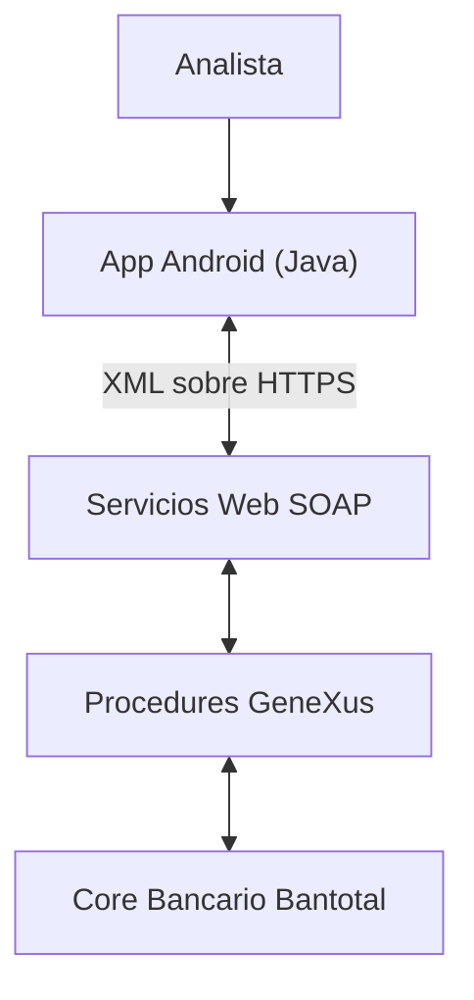
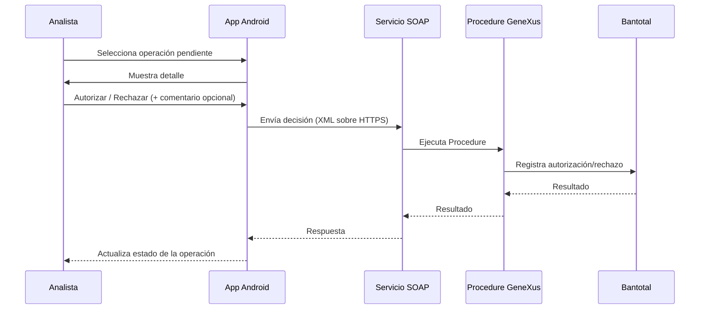

# App Aprobadores — Financiera Confianza

Aplicación Android nativa que permitía a analistas de Financiera Confianza consultar y autorizar operaciones financieras asociadas al core bancario **Bantotal**, desde un dispositivo móvil.

> 🔒 **Proyecto empresarial — código propietario.**
> Este repositorio es un **case study de documentación**. No contiene código fuente, procedures, WSDL, endpoints, credenciales ni ningún artefacto real del sistema. Todo ejemplo técnico incluido (XML, diagramas, datos) es **ilustrativo y ficticio**, construido solo para explicar el funcionamiento general y mi contribución.

---

## Índice

1. [Resumen](#resumen)
2. [La problemática](#la-problemática)
3. [La solución](#la-solución)
4. [Cómo funcionaba](#cómo-funcionaba)
5. [Mi participación](#mi-participación)
6. [Arquitectura](#arquitectura)
7. [Backend e integración](#backend-e-integración)
8. [Desarrollo Android](#desarrollo-android)
9. [UI/UX y navegación](#uiux-y-navegación)
10. [Flujo de autorización](#flujo-de-autorización)
11. [Testing](#testing)
12. [Desafíos técnicos](#desafíos-técnicos)
13. [Decisiones técnicas](#decisiones-técnicas)
14. [Resultado](#resultado)
15. [Evolución posterior](#evolución-posterior)
16. [Stack tecnológico](#stack-tecnológico)
17. [Confidencialidad](#confidencialidad)

---

## Resumen

App Aprobadores era una herramienta móvil interna para analistas de Financiera Confianza, orientada a la consulta y autorización de operaciones sobre el core bancario Bantotal: créditos, retiros, tasas pasivas, depósitos de plazo fijo y operaciones de clientes migrantes. Participé en tres de esos módulos (tasas pasivas, retiros, operaciones de clientes migrantes), tanto en la integración con los servicios que consumían Bantotal como en el desarrollo Android y en la navegación principal de la app.

## La problemática

Determinadas autorizaciones —créditos, retiros, tasas pasivas, depósitos de plazo fijo, operaciones de clientes migrantes— se gestionaban directamente desde la interfaz de Bantotal (BT). Para un analista que necesitaba revisar y autorizar operaciones fuera de su puesto de trabajo, esto significaba depender de una interfaz de escritorio pensada para el flujo completo del core bancario, no para una tarea puntual de revisión y aprobación.

Se buscaba una alternativa móvil enfocada específicamente en ese caso de uso: consultar operaciones pendientes y autorizarlas o rechazarlas, sin pasar por todo el proceso de Bantotal.

## La solución

App Aprobadores replicaba ese flujo puntual de autorización en un cliente Android nativo.

El analista iniciaba sesión con su usuario y contraseña de Bantotal, y podía configurar un código de seguridad de 4 dígitos como mecanismo adicional de acceso rápido. Una vez dentro, visualizaba sus operaciones agrupadas por categoría (Autorizaciones, Operaciones, Protocolos PDM, Excepciones) y, al entrar al detalle de una operación, podía revisarla, autorizarla o rechazarla, agregando opcionalmente un comentario. Esa decisión se enviaba a los servicios integrados con Bantotal, y el estado de la operación se actualizaba en la app.

## Cómo funcionaba

1. **Login** — usuario y contraseña de Bantotal, más un código de seguridad de 4 dígitos como segundo factor local.
2. **Bandejas por categoría** — Autorizaciones, Operaciones, Protocolos PDM, Excepciones.
3. **Detalle de operación** — datos de la operación pendiente de autorizar.
4. **Decisión del analista** — Autorizar o Rechazar, con comentario opcional.
5. **Envío e integración** — la decisión se enviaba a los servicios que la conectaban con Bantotal.
6. **Actualización de estado** — la app reflejaba el resultado de la operación.

  

### Ejemplo: flujo de autorización de Tasas Pasivas

1. El analista entra al módulo de **Tasas Pasivas** y ve la bandeja de operaciones pendientes.
2. Selecciona una operación y revisa su **detalle** (cliente, agencia, tasa máxima vs. tasa solicitada).
3. Decide **autorizar**, y en el modal de confirmación agrega un comentario opcional e ingresa su contraseña.
4. La app muestra el estado de **validación** mientras se procesa la solicitud contra los servicios integrados con Bantotal.
5. La app confirma que **la operación fue autorizada** con éxito.

*Datos de la captura ficticios (`CLIENTE GENERICO`, `ASESOR DEFAULT`).*

## Mi participación

**No desarrollé la aplicación completa.** Participé específicamente en tres módulos funcionales y en la navegación principal:

- Tasas pasivas
- Retiros
- Operaciones de clientes migrantes

Mi contribución cubrió dos frentes: el backend/integración de esos tres flujos (Procedures GeneXus expuestos como servicios SOAP sobre Bantotal) y el desarrollo Android de esos módulos, más el rediseño de la navegación principal de la app completa.

### Android / Java
Desarrollo de las pantallas de bandeja, detalle y confirmación de mis tres módulos; lógica de aprobación/rechazo; procesamiento de las respuestas de los servicios y actualización del estado de la operación en la UI.

### GeneXus / Bantotal
Diseño e implementación de Procedures en GeneXus para los flujos de tasas pasivas, retiros y operaciones de clientes migrantes, expuestos como servicios web SOAP sobre el core bancario Bantotal.

### SOAP / XML
La app Android consumía estos servicios mediante intercambio de XML sobre HTTPS. Participé en la integración entre la app móvil, los servicios y Bantotal para estos tres flujos.

### UI/UX
Rediseño del shell de navegación principal (de menú lateral a `BottomNavigationView`), transiciones animadas (Animatoo), animaciones de estado (Lottie), pantallas modales de confirmación y zoom de imágenes/documentos (PhotoView) — aplicado a mis tres módulos.

### Testing
Validación de los servicios SOAP con SoapUI (consulta de WSDL, ejecución de requests, validación de respuestas) y Postman.

**Fuera de mi participación:** el resto de módulos de la app (créditos, depósitos de plazo fijo, y las bandejas/backend de otros flujos no listados arriba).

## Arquitectura

Arquitectura conceptual del flujo de autorización (sin nombres de servicios, campos ni endpoints reales):

- **App Android (Java):** UI de bandeja/detalle/confirmación, y cliente HTTP que arma y envía el XML de la operación.
- **Servicios Web SOAP:** capa de exposición de los Procedures GeneXus hacia la app móvil.
- **Procedures GeneXus:** lógica de negocio que traduce la solicitud del analista en operaciones sobre Bantotal.
- **Bantotal:** core bancario donde finalmente se registra la autorización/rechazo.

Más detalle en <a href="docs/arquitectura.md" target="_blank" rel="noopener noreferrer"><code>docs/arquitectura.md</code></a>.

## Backend e integración

Diseñé e implementé los Procedures GeneXus de tasas pasivas, retiros y operaciones de clientes migrantes, expuestos como servicios web SOAP sobre Bantotal. La app Android consumía estos servicios mediante XML sobre HTTPS, y participé en la integración de punta a punta (app → servicio → Bantotal) para estos tres flujos.

Detalle técnico y un flujo ilustrativo (con datos ficticios) en <a href="docs/desarrollo.md" target="_blank" rel="noopener noreferrer"><code>docs/desarrollo.md</code></a>.

## Desarrollo Android

App Android nativa en Java. En mis tres módulos: pantallas de bandeja (listado de operaciones pendientes), pantallas de detalle, pantallas de confirmación, lógica de autorizar/rechazar, procesamiento de la respuesta del servicio y actualización del estado de la operación.

Detalle completo en <a href="docs/desarrollo.md" target="_blank" rel="noopener noreferrer"><code>docs/desarrollo.md</code></a>.

## UI/UX y navegación

La app usaba originalmente un menú lateral (drawer). Implementé un nuevo shell de navegación (`PrincipalActivity` + `BottomNavigationView`) con navegación inferior por iconos, siguiendo Material Design. También integré Animatoo (transiciones entre pantallas), Lottie (animaciones de estado, principalmente carga/confirmación), pantallas modales de confirmación y PhotoView (zoom de imágenes/documentos asociados a las operaciones).

## Flujo de autorización

Ejemplo ilustrativo de extremo a extremo (ver el detalle y el XML de ejemplo en <a href="docs/desarrollo.md" target="_blank" rel="noopener noreferrer"><code>docs/desarrollo.md</code></a>):

## Testing

Validación de los servicios SOAP con **SoapUI** (obtención/consulta de WSDL, ejecución de requests, validación de respuestas) y **Postman**, antes de su integración con la app Android.

## Desafíos técnicos

- Integrar un cliente Android nativo con servicios SOAP/XML expuestos desde GeneXus, en un ecosistema (Bantotal) pensado originalmente para interfaces de escritorio, no para consumo móvil.
- Procesar y validar XML de request/response de forma confiable dentro del ciclo de vida de una app Android.
- Mantener consistencia en los flujos de autorización/rechazo de tres módulos distintos (tasas pasivas, retiros, migrantes), cada uno con su propia lógica de negocio en Bantotal.
- Rediseñar la navegación principal (de drawer a `BottomNavigationView`) sin romper el acceso a los módulos ya existentes de otros equipos dentro de la misma app.
- Diseñar una experiencia de confirmación (modal + comentario opcional) que fuera clara para el analista antes de una acción que impacta directamente el core bancario.

## Decisiones técnicas

Más detalle y razonamiento en <a href="docs/decisiones-tecnicas.md" target="_blank" rel="noopener noreferrer"><code>docs/decisiones-tecnicas.md</code></a>. En resumen:

- Android nativo (Java) como plataforma cliente.
- SOAP como mecanismo de integración, consistente con el ecosistema GeneXus/Bantotal ya existente.
- `BottomNavigationView` (Material Components) para la navegación principal, en reemplazo del drawer.
- Lottie para comunicar estados de carga/confirmación sin bloquear la percepción de progreso del analista.
- PhotoView para permitir revisar con zoom imágenes/documentos asociados a una operación antes de decidir.

## Resultado

La aplicación permitió a analistas de Financiera Confianza gestionar determinadas autorizaciones desde dispositivos móviles, integrándose con servicios empresariales asociados al core bancario Bantotal, para los flujos de tasas pasivas, retiros y operaciones de clientes migrantes.

*(No incluyo cifras de usuarios, volumen de operaciones ni métricas de mejora: no tengo esos datos confirmados.)*

## Evolución posterior

Según referencia directa del Scrum Master del proyecto, la funcionalidad desarrollada en App Aprobadores fue posteriormente migrada e integrada en una nueva aplicación corporativa de Financiera Confianza, desarrollada en Flutter. No participé en ese desarrollo — se menciona únicamente como contexto de la evolución del producto.

**Aplicación corporativa actual / evolución de la solución:** <a href="https://play.google.com/store/apps/details?id=pe.confianza.cliente" target="_blank" rel="noopener noreferrer">Google Play</a>

## Stack tecnológico

Java · Android SDK · GeneXus · Bantotal · SOAP · XML · HTTPS · Material Design · `BottomNavigationView` · Lottie · Animatoo · PhotoView · SoapUI · Postman · Git

## Confidencialidad

App Aprobadores es propiedad de Financiera Confianza. Este repositorio:

- No contiene código Java ni Procedures GeneXus reales.
- No contiene WSDL, endpoints, IPs, credenciales, tokens ni certificados reales.
- No contiene datos de clientes, DNI, números de cuenta ni información financiera u operativa real.
- Cualquier XML, diagrama o dato técnico mostrado aquí es **ficticio e ilustrativo**.
- Cualquier captura de pantalla debe estar previamente sanitizada/anonimizada y solo se publica si existe autorización para usarla — ver <a href="screenshots/README.md" target="_blank" rel="noopener noreferrer"><code>screenshots/README.md</code></a>.

Para más detalle técnico, con gusto lo explico en una entrevista.
