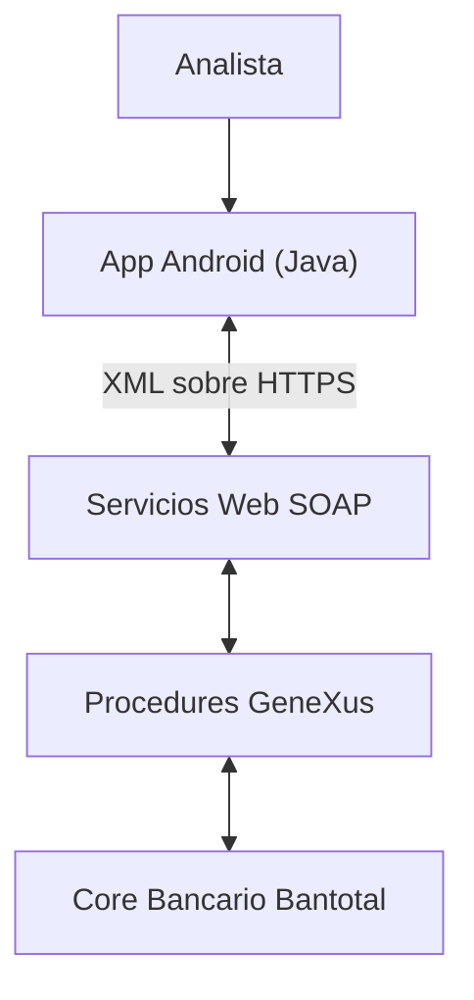

# Arquitectura

> Diagrama conceptual, sin nombres de servicios, campos ni endpoints reales. El objetivo es explicar el rol de cada capa, no documentar la implementación real.

## Capas y responsabilidades

### App Android (Java)
Cliente móvil usado por el analista. Responsable de:
- Autenticar al analista (usuario/contraseña de Bantotal + código de seguridad local de 4 dígitos).
- Mostrar las bandejas de operaciones pendientes por categoría (Autorizaciones, Operaciones, Protocolos PDM, Excepciones).
- Mostrar el detalle de una operación seleccionada.
- Capturar la decisión del analista (autorizar/rechazar + comentario opcional).
- Armar y enviar el XML de la solicitud sobre HTTPS.
- Procesar la respuesta y actualizar el estado de la operación en la UI.

### Servicios Web SOAP
Capa de exposición: recibe las solicitudes XML de la app y las traduce en ejecuciones de Procedures GeneXus. Es el punto de integración entre el mundo móvil y el ecosistema GeneXus/Bantotal.

### Procedures GeneXus
Lógica de negocio del lado del servidor. Cada uno de mis tres módulos (tasas pasivas, retiros, operaciones de clientes migrantes) tenía su propio Procedure, responsable de validar y ejecutar la autorización/rechazo contra Bantotal.

### Core Bancario Bantotal
Sistema donde finalmente se registra el resultado de la operación (autorizada o rechazada). Es la fuente de verdad del negocio; la app y los servicios existen para dar una vía de acceso móvil a una porción específica de sus procesos de autorización.

## Por qué esta arquitectura (y qué **no** es)

- **No es una arquitectura de microservicios.** Es una integración punto a punto entre un cliente móvil y un ecosistema GeneXus/Bantotal ya existente.
- **No hay API Gateway, contenedores ni orquestación** — no participé en, ni tengo evidencia de, ese tipo de infraestructura para este proyecto.
- **SOAP no fue una elección "moderna"**, fue la forma de integración consistente con cómo GeneXus exponía sus Procedures en este ecosistema al momento del proyecto.

## Diagrama de secuencia del flujo de autorización

Ver <a href="desarrollo.md" target="_blank" rel="noopener noreferrer"><code>desarrollo.md</code></a> para el detalle del flujo con datos ficticios.
