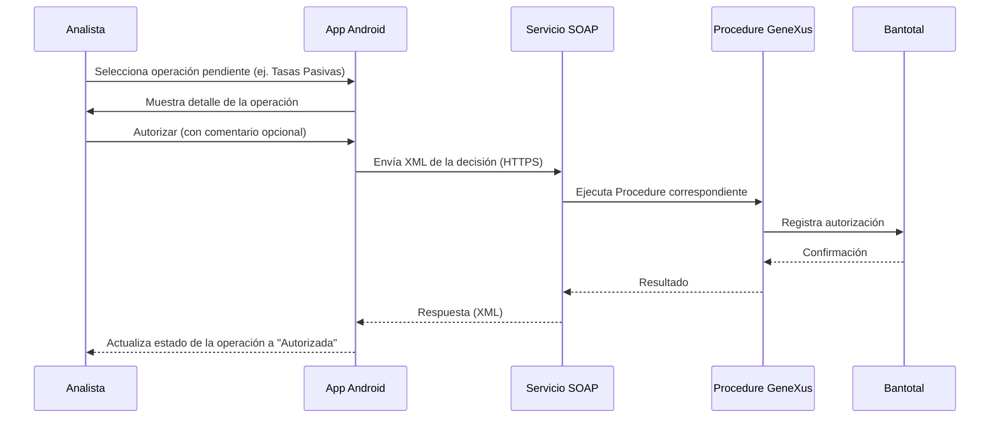

# Desarrollo

Detalle de mi contribución, separado por área. Cubre exclusivamente los tres módulos en los que participé: **tasas pasivas, retiros y operaciones de clientes migrantes.**

## Android / Java

App Android nativa en Java. En mis tres módulos desarrollé:

- **Pantallas de bandeja** — listado de operaciones pendientes de autorización.
- **Pantallas de detalle** — información de la operación seleccionada.
- **Pantallas de confirmación** — modal para autorizar/rechazar, con comentario opcional.
- **Lógica de aprobación/rechazo** — construcción de la solicitud hacia el servicio correspondiente.
- **Procesamiento de la respuesta del servicio** y actualización del estado de la operación en la UI.

## GeneXus / Bantotal

Diseñé e implementé los Procedures en GeneXus para los tres flujos mencionados, expuestos como servicios web SOAP sobre el core bancario Bantotal. Estos Procedures son los responsables de validar la solicitud del analista y ejecutar la autorización o el rechazo contra Bantotal.

## SOAP / XML

La comunicación entre la app Android y los servicios se realizaba mediante intercambio de XML sobre HTTPS. Participé en la integración de punta a punta: app móvil → servicio SOAP → Procedure GeneXus → Bantotal, para mis tres flujos.

## UI/UX

- Rediseño del shell de navegación principal de la app, de un menú lateral (drawer) a un `BottomNavigationView` (Material Components) con `PrincipalActivity` como contenedor.
- Transiciones animadas entre pantallas (Animatoo).
- Animaciones de estado (Lottie), principalmente para carga y confirmación.
- Pantallas modales de confirmación para los flujos de autorizar/rechazar.
- Zoom de imágenes/documentos asociados a una operación (PhotoView).

## Testing

Validación de los servicios SOAP antes de integrarlos con la app:

- **SoapUI** — consulta de WSDL, ejecución de requests, validación de respuestas, pruebas de los servicios.
- **Postman** — pruebas adicionales de los servicios.

## Caso de estudio técnico: flujo de autorización

> **Ejemplo ilustrativo.** Los nombres de campos, servicios y la estructura del XML son ficticios y no corresponden a contratos, endpoints ni datos reales del sistema. Su único propósito es explicar la mecánica general del flujo.



Ejemplo **ficticio** de la solicitud que la app enviaría al servicio:

```xml
<OperationRequest>
    <OperationId>DEMO-001</OperationId>
    <Module>TASAS_PASIVAS</Module>
    <Action>APPROVE</Action>
    <Comment>Ejemplo de comentario opcional</Comment>
</OperationRequest>
```

Y la respuesta, también ficticia:

```xml
<OperationResponse>
    <OperationId>DEMO-001</OperationId>
    <Status>APPROVED</Status>
    <Message>Operacion procesada correctamente</Message>
</OperationResponse>
```

*Ejemplo ilustrativo. No corresponde a contratos, endpoints ni datos reales del sistema.*
